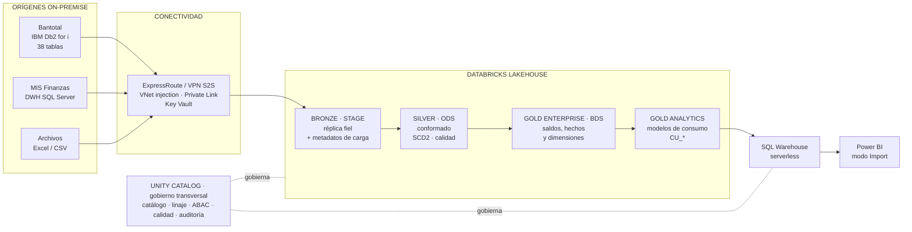

# 02 · Arquitectura de referencia

---

## 1. Visión general

La arquitectura ya estaba definida. Este documento no la cambia: explica **por qué
cada pieza está donde está**, porque un equipo que entiende la razón toma mejores
decisiones cuando aparece un caso que el diagrama no previó.

---

## 2. Las capas y qué garantiza cada una

### Bronze · STAGE — la verdad del origen

Réplica fiel de las 38 tablas, sin transformar. Se agregan metadatos de carga:
fecha de proceso, identificador de lote, origen y marca de tiempo de extracción.

**La garantía es reprocesabilidad.** Si mañana se descubre que la regla de un saldo
estaba mal, se corrige la regla y se recalcula Silver y Gold sin volver a tocar
Bantotal. Volver al core es la operación más cara y la más molesta para el área que
lo opera, y Bronze existe para no tener que hacerlo.

De ahí la regla que no se negocia: **en Bronze no se limpia nada.** Ni un tipo, ni
un espacio de más, ni un nulo. El dato entra como está. Limpiar aquí es perder para
siempre la evidencia de cómo llegó, y esa evidencia es lo que se necesita el día que
una cifra no cuadra y hay que probar si el problema era del origen o del proceso.

### Silver · ODS — el dato conformado

Limpieza, tipificación, homologación y reglas básicas de calidad. Maestros con
historia (SCD2). Registro de ajustes versionado.

**La garantía es consistencia.** Un cliente es el mismo cliente sin importar por qué
tabla llegó, una moneda se escribe igual en todos lados, una fecha es una fecha y
no un texto.

Aquí viven las 30 reglas de calidad. Una regla que falla en Silver detiene la
propagación a Gold: es más barato retener una carga que explicar por qué el tablero
estuvo mal medio día.

### Gold Enterprise · BDS — el modelo corporativo

Saldos y balances en sus tres versiones (original, ajuste, ajustado), hechos
contables y de planeamiento (unos 2 millones de registros diarios), dimensiones
conformadas, y las reglas expertas y cuadres contra MIS.

**La garantía es que el número es el número.** Es la capa que Finanzas defiende ante
el Directorio, y la que se reconcilia contra MIS durante las tres semanas de
paralelo.

La propagación automática del ajuste de balance a saldos, indicadores y reportes
vive aquí, con sus controles y su bitácora. Es la pieza funcional más delicada de
todo el diseño: un ajuste que se propaga mal contamina todo lo que está aguas abajo
y no es evidente a simple vista.

### Gold Analytics — los modelos de consumo

Tablas `CU_Contabilidad`, `CU_Resultados`, `CU_Detalle_Productos`, `CU_Proyecciones`
y las maestras compartidas, en esquema estrella, agregadas para Power BI.

**La garantía es rendimiento y estabilidad del contrato.** Power BI no consulta el
modelo corporativo directamente: consulta una capa pensada para él. Así, un cambio
en el modelo corporativo no rompe cuatro tableros el mismo día, y un cambio en un
tablero no obliga a tocar el modelo contable.

Esa separación entre Gold Enterprise y Gold Analytics es la decisión de diseño más
subestimada de la arquitectura. Es lo que permite que el modelo contable evolucione
por razones contables y los tableros por razones de usuario, sin que cada cambio
sea una negociación entre dos áreas.

---

## 3. Ingesta

| Origen | Mecanismo | Patrón |
|---|---|---|
| Bantotal (Db2 for i) | Lakeflow Jobs + JDBC (JTOpen) | Incremental por marca de agua o fecha de proceso, sobre réplica o ventana acordada |
| MIS (SQL Server) | Lakeflow Connect + Lakehouse Federation | Conector gestionado; federación para cuadres sin duplicar datos |
| Archivos (Excel/CSV) | Auto Loader sobre Volumes de UC | Detección automática, procesamiento exactamente una vez |

Tres notas sobre decisiones que el diagrama muestra pero no explica.

**Por qué marca de agua y no CDC.** Ver [ADR-003](10_DECISIONES_ADR.md#adr-003).
Resumen: el CDC sobre Db2 for i exige journaling en el core, licenciamiento propio y
una conversación con el área del AS/400. Es otro proyecto, y descubrirlo a mitad de
la Fase 1 cuesta un trimestre.

**Por qué federación para MIS y no copia.** Los cuadres contra MIS necesitan leer
el dato de MIS, no tenerlo. Federar evita duplicar un data warehouse entero para
comparar totales, y evita la pregunta incómoda de cuál de las dos copias es la
buena.

**Por qué Volumes de Unity Catalog y no una carpeta de ADLS.** Un Volume tiene
permisos, linaje y auditoría de Unity Catalog. Una carpeta de ADLS tiene permisos de
ADLS, que viven en otro sitio y se gestionan con otra herramienta. Cuando auditoría
pregunte quién dejó ese Excel de ajustes, la respuesta tiene que estar en el mismo
lugar que todas las demás.

---

## 4. Almacenamiento

ADLS Gen2 en la suscripción del banco, como *managed storage* de Unity Catalog, un
contenedor por catálogo y entorno. Formato Delta Lake.

El ciclo de vida sigue Hot → Cool → Cold según antigüedad, y la Predictive
Optimization se encarga de `OPTIMIZE` y `VACUUM`.

Un parámetro que no se deja al defecto: **la retención de time travel**. El valor
por defecto es de siete días, que no alcanza para revertir un cierre mensual que se
detecta tarde. En producción se declara explícitamente para cubrir al menos dos
cierres. Ver [03 · Reversión](03_CICD_Y_DATAOPS.md#7-reversión).

---

## 5. Gobierno

Unity Catalog es la capa única: catálogo y glosario, calidad, linaje de punta a
punta, permisos ABAC, enmascaramiento y auditoría en `system tables`.

El linaje merece un párrafo porque es lo que más se subestima. Incluye orígenes
externos y Power BI, de modo que se puede responder **"qué campos de Bantotal
alimentan esta celda del tablero de Contabilidad"** sin reconstruirlo a mano. Esa
pregunta aparece siempre: cuando hay que cambiar algo y saber qué se rompe, y
cuando auditoría pregunta de dónde sale un número.

El detalle de permisos, identidades y enmascaramiento está en
[07 · Gobierno, seguridad y redes](07_GOBIERNO_SEGURIDAD_Y_REDES.md).

---

## 6. Consumo

SQL Warehouse serverless con Photon, talla mínima y auto-stop a los cinco minutos,
encendido solo en ventanas de refresco y consulta.

Power BI en modo Import con refresco incremental, disparado por el trabajo de
Lakeflow al terminar la carga. Cuatro tableros: Contabilidad (7 pestañas),
Resultados, Detalle de productos y Proyecciones.

La decisión de no usar DirectQuery es de costo y está en
[ADR-002](10_DECISIONES_ADR.md#adr-002): con DirectQuery, cada usuario que abre un
tablero enciende el warehouse, y el gasto pasa a depender de cuánta gente mire los
tableros y a qué hora. El cierre contable concentra a muchos usuarios en pocos días,
que es el peor patrón posible para ese modelo.

---

## 7. Habilitación de ML e IA

La arquitectura incluye la base: catálogo `sandbox` gobernado, MLflow, Feature
Engineering en Unity Catalog, Model Serving serverless con escalado a cero, y AI/BI
Genie sobre Gold.

Es **habilitación**, no desarrollo de modelos. Lo que se construye ahora es el
andamio para que una iniciativa posterior no tenga que empezar por pelear con la
plataforma.

Dos restricciones que conviene fijar desde el principio, porque relajarlas después
es imposible: el catálogo `sandbox` tiene su propia cuota de costo, y **nada que
nazca en `sandbox` puede llegar a producción sin pasar por el flujo normal de
ingeniería**. Un modelo que se entrenó en un notebook y se publicó a mano es
exactamente lo que este conjunto de documentos existe para evitar.

---

## 8. Dimensionamiento conocido

| Concepto | Valor |
|---|---|
| Tablas de origen | 38 |
| Frecuencia de carga | Diaria |
| Hechos contables y de planeamiento | ~2 millones de registros/día |
| Reglas de calidad | 30 |
| Perfilamientos | 20 |
| Tableros de Power BI | 4 (Contabilidad con 7 pestañas) |
| Tablas CU en Gold Analytics | Hasta 4 + maestras |
| Paralelo con MIS | 3 semanas |

Estos números definen la escala real del problema, y conviene tenerlos presentes al
discutir alternativas. Dos millones de registros diarios y 38 tablas es un volumen
que cabe holgadamente en la arquitectura propuesta; no es lo que justifica las
decisiones de diseño. **Lo que las justifica es la criticidad contable y la
trazabilidad**, no el volumen.

---

## Documentos relacionados

- [03 · CI/CD y DataOps](03_CICD_Y_DATAOPS.md)
- [05 · Estándares y convenciones](05_ESTANDARES_Y_CONVENCIONES.md)
- [10 · Decisiones de arquitectura](10_DECISIONES_ADR.md)
